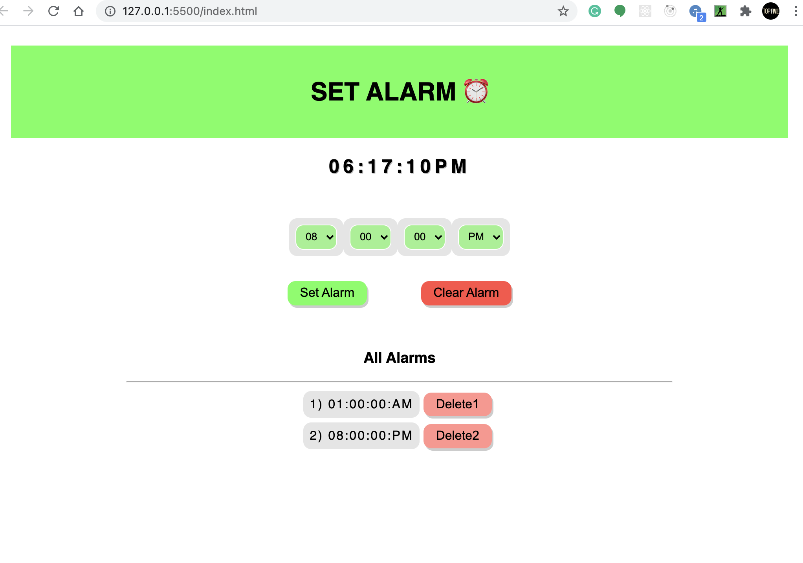

# ALARMCLOCK

It is a solution to the Coding Ninjas CareerCamp Web dev-test1. Please visit the Coding Ninjas career camp website [CodingNinjas CareerCamp](https://careercamp.codingninjas.com/?utm_source=codingninjas&utm_medium=top_navigation&utm_campaign=landing_header) for more details.

## Table of contents

- [Overview](#overview)
  - [Screenshot](#screenshot)
  - [Links](#links)
- [My process](#my-process)
  - [Built with](#built-with)
  - [What I learned](#what-i-learned)
  - [Useful resources](#useful-resources)
- [Author](#author)
- [Acknowledgments](#acknowledgments)

## Overview

It is an alarm clock made in HTML, CSS and Vanilla Javascript. You can set as many alarms that you want.

### Screenshot



### Links

- Live Site URL: [Live Website](https://kurosakicoder.github.io/AlarmClock/)

## My process

First, I designed the skeleton of the design using HTML and CSS. Then, I started coding in Javascript and also made changes in HTML and CSS.

### Built with

- HTML
- CSS custom properties
- Vanilla JavaScript

### What I learned

I got to learn how to use audio sound in alarm clock and manipulate the Date function

```js
var sound = new Audio("ringtone.mp3");
sound.loop = true;
```

### Useful resources

- [JavaScript getMilliseconds() Method](https://www.w3schools.com/jsref/jsref_getmilliseconds.asp) - The getMilliseconds() method returns the milliseconds (from 0 to 999) of the specified date and time.
- [JavaScript Clock - W3Schools](https://www.w3schools.com/js/tryit.asp?filename=tryjs_timing_clock)

## Author

- LinkedIn - [Khaidem Sandip Singha ](https://www.linkedin.com/in/khaidemsandip/)
- Twitter - [@KurosakiCoder](https://twitter.com/KurosakiCoder)

## Acknowledgments

I have done this project from scratch by referencing the websites that I mentioned.
